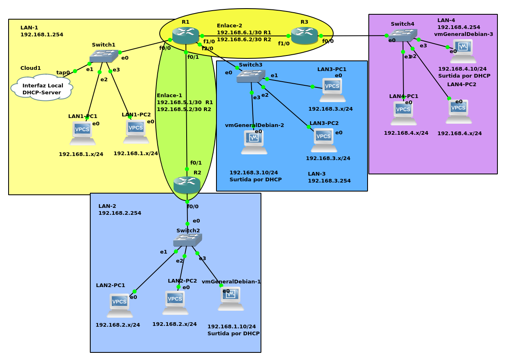
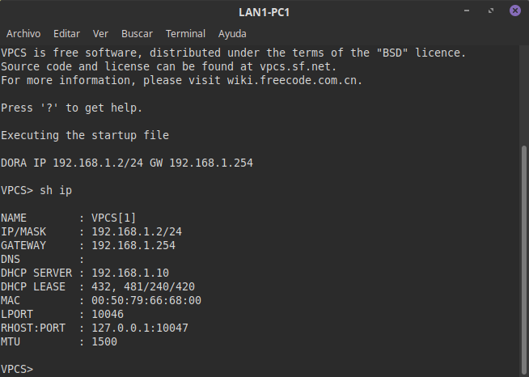
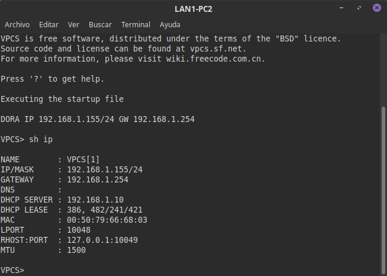
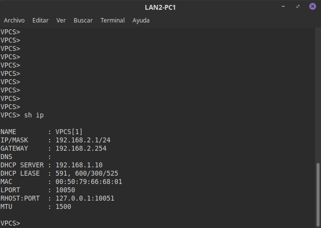
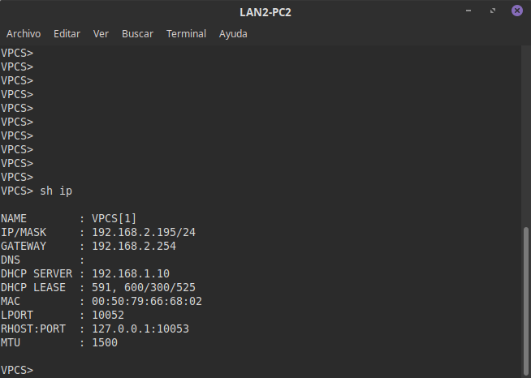
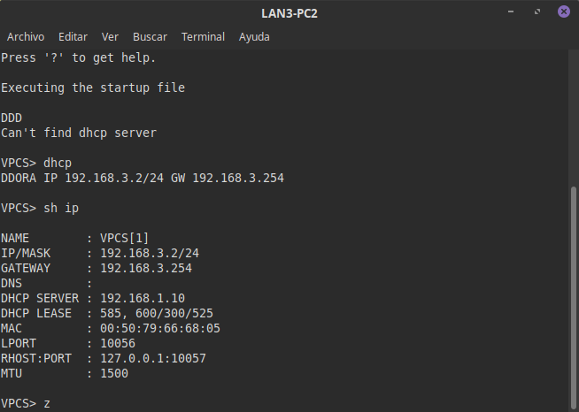
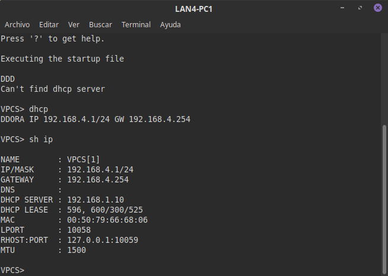
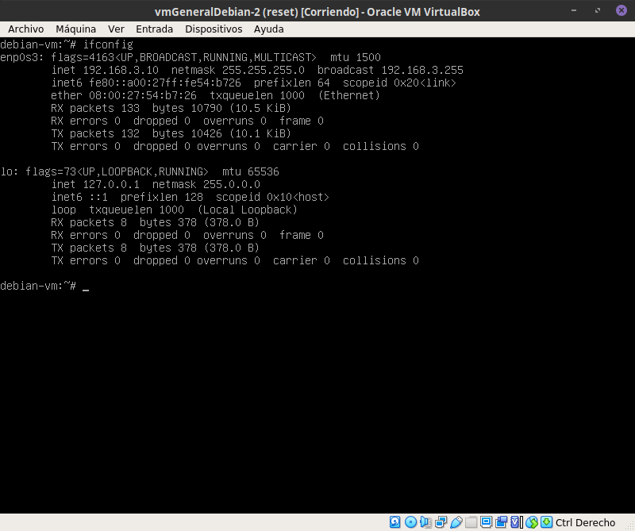
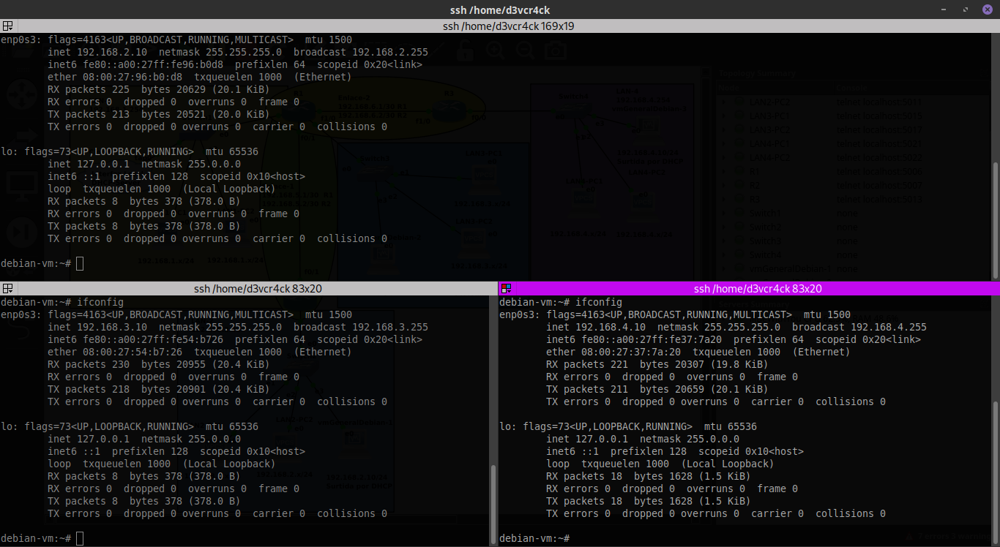

# Servidor DHCP #

## Instalación Fedora ##

```
# dnf -y install dhcp
```

## Instalación Debian ##

```
# apt install isc-dhcp-server -y
```

### Configuración montada en la interfas virtual tap0 ###

[fileConf](dhcpd.conf)

```
#Archivo configuración dhcpd (en Fedora/Debian /etc/dhcp/dhcpd.conf)
default-lease-time 600;
max-lease-time 7200;
log-facility local7;
#DHCP para VPCS
subnet 192.168.1.0 netmask 255.255.255.0 {
  range 192.168.1.1 192.168.1.253;
  option routers 192.168.1.254;
}
subnet 192.168.2.0 netmask 255.255.255.0 {
  range 192.168.2.1 192.168.2.253;
  option routers 192.168.2.254;
}
subnet 192.168.3.0 netmask 255.255.255.0 {
  range 192.168.3.1 192.168.3.253;
  option routers 192.168.3.254;
}
subnet 192.168.4.0 netmask 255.255.255.0 {
  range 192.168.4.1 192.168.4.253;
  option routers 192.168.4.254;
}
#IP's estaticas de VM
host vm1{
  hardware ethernet 08:00:27:96:B0:D8;
  fixed-address 192.168.2.10;
  option routers 192.168.2.254;
  option subnet-mask 255.255.255.0;
}
host vm2{
  hardware ethernet 08:00:27:54:B7:26;
  fixed-address 192.168.3.10;
  option routers 192.168.3.254;
  option subnet-mask 255.255.255.0;
}
host vm3 {
  hardware ethernet 08:00:27:37:7A:20;
  fixed-address 192.168.4.10;
  option routers 192.168.4.254;
  option subnet-mask 255.255.255.0;
}
```

### Configuración de firewall y habilitación servidor DHCP ###

```
  # systemctl enable dhcpd
  # firewall-cmd --add-service=dhcpd --permanent
  # firewall-cmd --reload
  # systemctl start dhcpd
```

### Para que las VPCS Obtengan dirección IP del server DHCP ###

```
  VPCS[#]> dhcp
  // En el output de la VPCS se debe observar el proceso de DHCP Discover (D)
  // DHCP Offer (O), DHCP Request (R), Acknowledge (A)
  // El cual obtendra la IP del servidor DHCP
```

### En los routers para redireccionar el trafico para que llegue al DHCP ###

```
  Router-n# conf t
  Router-n(config)# int <interfaz-externa-a-la-red-del-servidor>
  Router-n(config-int)# ip helper-address <IP-servidor-DHCP>
```

### Imagenes relacionadas ###

___Topología___



___LAN-1___





___LAN-2___





___LAN-3___




___LAN-4___




___LAN-2-VM___


___LAN-3-VM___



___LAN-4-VM___


___Conexión ssh con las VM___



### Video relacionado con el funcionamiento: ###

[Video click.](./reporte/video/dhcp.mp4)
